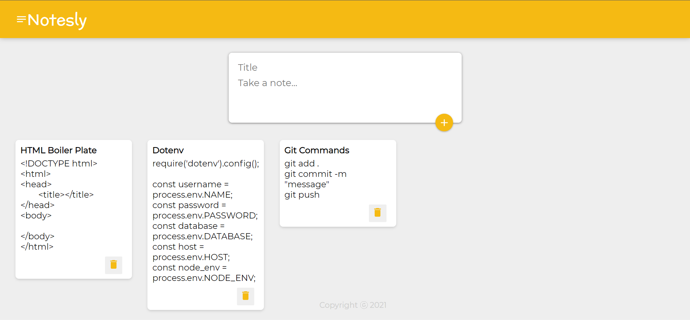

# NOTES-ly 📅
Keep your notes easily with Notesly. This is a React based app. 

## Tech Stack 🚀

[]() []() []

To run the project follow the given commands in your terminal.<br>
```
npm install
```
The above command installs all dependencies. Then to run the project:<br>
```
npm start
```
### Demonstration of how the app looks 🌟 <br>

